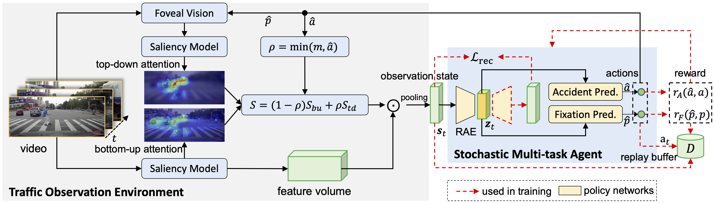

# DRIVE (**D**eep **R**e**I**nforced Accident Anticipation with **V**isual **E**xplanation)
[Project](https://www.rit.edu/actionlab/drive) **|** [Paper & Supp](https://arxiv.org/abs/2107.10189) **|** [Demo](https://www.youtube.com/watch?v=A3bTWejzUwM)

[Wentao Bao](https://cogito2012.github.io/homepage), 
[Qi Yu](https://www.rit.edu/mining/qi-yu), 
[Yu Kong](https://people.rit.edu/yukics/)

International Conference on Computer Vision (**ICCV**), 2021.

## Table of Contents
1. [Introduction](#introduction)
1. [Installation](#installation)
1. [Datasets](#datasets)
1. [Testing](#testing)
1. [Training](#training)
1. [Citation](#citation)

## Introduction

We propose the DRIVE model which uses Deep Reinforcement Learning (DRL) to solve explainable traffic accident anticipation problem. This model simulates both the bottom-up and top-down visual attention mechanisms in a dashcam observation environment so that the decision from the proposed stochastic multi-task agent can be visually explained by attentive regions. Moreover, the proposed dense anticipation reward and sparse fixation reward are effective in training the DRIVE model with the improved Soft Actor Critic DRL algorithm. 



## Installation

**Note**: This repo is developed using `pytorch 1.4.0` in Ubuntu 18.04 LTS OS with `CUDA 10.1` GPU environment. However, more recent pytorch and CUDA versions are also compatible with this repo, such as `pytorch 1.7.1` and `CUDA 11.3`.

a. Create a conda virtual environment of this repo, and activate it:

```shell
conda create -n pyRL python=3.7 -y
conda activate pyRL
```

b. Install official pytorch. Take the `pytorch==1.4.0` as an example:
```shell
conda install pytorch==1.4.0 torchvision==0.5.0 cudatoolkit=10.1 -c pytorch
```

c. Install the rest dependencies.
```shell
pip install -r requirements.txt
```

## Datasets

This repo currently supports for the down-sized version of [DADA-2000 dataset](https://github.com/JWFangit/LOTVS-DADA). Specifically, we reduced the image size at a half and trimmed the videos into accident clips with at most 450 frames. For more details, please refer to the code script `data/reduce_data.py`. 

We also noticed that the original DATA-2000 dataset was updated, here we provide the processed [DADA-2000-small.zip](https://drive.google.com/file/d/1o0TBvwp2UPBmhOsvsXRL1uJoCR4NK15X/view?usp=sharing) for your convenience. Simply download and unzip it into `data` folder:
```shell
cd data
unzip DADA-2000-small.zip ./
```

## Testing

a. Download the pretrained saliency models.

The pre-trained saliency models are provided here: [saliency_models](https://drive.google.com/drive/folders/1BcL3zMnj9qqwDobIq09yaaB0kbZDK8n8?usp=sharing), where the `mlnet_25.pth` is used by default in this repo. Please place the file to the path `models/saliency/mlnet_25.pth`.

b. Download the pre-trained DRIVE model:

The pre-trained DRIVE model is provided here: [DADA2KS_Full_SACAE_Final](https://drive.google.com/drive/folders/1MUdHWLNHH6Uf2g1d3XMc8oF3OlUi3ubh?usp=sharing), and place the model file to the path `output/DADA2KS_Full_SACAE_Final/checkpoints/sac_epoch_50.pt`. 

c. Run the DRIVE testing.
```shell
bash script_RL.sh test 0 4 DADA2KS_Full_SACAE_Final
```
Wait for a while, results will be reported.


## Training

This repo suports for training DRIVE models based on two DRL algorithms, i.e., REINFORCE and SAC, and two kinds of visual saliency features, i.e., MLNet and TASED-Net. By default, we use SAC + MLNet to achieve the best speed and accuracy trade-off.

a. Download the pretrained saliency models.

The pre-trained saliency models are provided here: [saliency_models](https://drive.google.com/drive/folders/1BcL3zMnj9qqwDobIq09yaaB0kbZDK8n8?usp=sharing), where the `mlnet_25.pth` is used by default in this repo. Please place the file to the path `models/saliency/mlnet_25.pth`.

b. Run the DRIVE training.
```shell
bash script_RL.sh train 0 4 DADA2KS_Full_SACAE_Final
```

c. Monitoring the training on Tensorboard.

Visualizing the training curves (losses, accuracies, etc.) on TensorBoard by the following commands:
```shell
cd output/DADA2KS_Full_SACAE_Final/tensorboard
tensorboard --logdir=./ --port 6008
```
Then, you will see the generated url address `http://localhost:6008`. Open this address with your Internet Browser (such as Chrome), you will monitoring the status of training.

**TIPs**:

If you are using SSH connection to a remote server without monitor, tensorboard visualization can be done on your local machine by manually mapping the SSH port number:
```shell
ssh -L 16008:localhost:6008 {your_remote_name}@{your_remote_ip}
```
Then, you can monitor the tensorboard by the port number `16008` by typing `http://localhost:16008` in your browser.


## Citation

If you find the code useful in your research, please cite:

    @inproceedings{BaoICCV2021DRIVE,
      author = "Bao, Wentao and Yu, Qi and Kong, Yu",
      title = "Deep Reinforced Accident Anticipation with Visual Explanation",
      booktitle = "International Conference on Computer Vision (ICCV)",
      year = "2021"
    }

## License

See [MiT License](/LICENSE)


## Acknowledgement

We sincerely thank all of the following great repos: [pytorch-soft-actor-critic](https://github.com/pranz24/pytorch-soft-actor-critic), [pytorch-REINFORCE](https://github.com/chingyaoc/pytorch-REINFORCE), [MLNet-Pytorch](https://github.com/immortal3/MLNet-Pytorch), and [TASED-Net](https://github.com/MichiganCOG/TASED-Net).